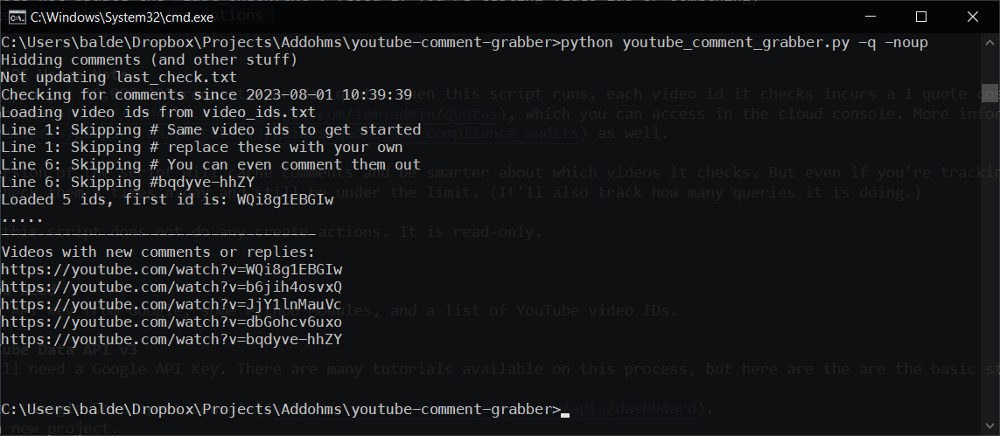

# youtube-comment-grabber
This code is pretty rough, but it might accidentally be helpful if you want to see examples of interacting with the YouTube API. Soon I'll be replacing this with a database version that's a bit more friendly to use.

The purpose of the tool is to help find when people reply to videos on channels you do not own. Eventually, you'll be able to reply directly from the command line.

# First-time usage
This script uses a virtual environment. It will pull in several python modules (including the Google Client API). Here's the general steps for setup.

1. Get a YouTube Data API v3 API Key. (See section below)
2. Setup Python virtual environment (see section below)
5. Copy `.env_sample` to `.env`
6. Edit `.env` to include your Youtube Data API v3 API Key.
7. Edit `.env` to include your local timezone (([Here is a list of supported pytz timezones](https://gist.github.com/heyalexej/8bf688fd67d7199be4a1682b3eec7568)))
8. Edit `video_ids.txt` to contain at least 1 video id you want to check.

## Setup Python Virtual Environment
Here's the three steps that need to happen before the script runs. You only need to do #1 and #3 once.
1. One time only, to create a python virtual environment (venv) with:
```python3 -m venv venv```

2. Activate the venv
Unix: `source venv/bin/activate`
Windows: `.\venv\Scripts\activate`
(Use `deactivate` to leave the venv.)

3. Install Pip Packages
```pip install -r requirements.txt```

# Usage
1. Activate the venv
Unix: `source venv/bin/activate`
Windows: `.\venv\Scripts\activate`

2. To check for new comments, run `python youtube_comment_grabber.py`.

3. If you want to leave the venv, then use the `deactivate` command.

It will check each video id and its comments for anything posted since the last time the script ran. 

(Currently) The script uses the date in the meta table of the database to compare against. It stores the date in the time zone defined in `.env`. (That way it is easier to edit.)

There isn't much in the way of error checking, so do not be surprised if the script just fails. 

## Command Line Options
Super basic commandline checks. Please use the same case for `noup`
* `-q` is a quiet mode. You'll only get status updates and a list of URLs with new comments (or replies.)
* `-noup` does not update last-check in the db`. (Good if you're testing video_ids or something)
* `-h  lists these three amazing options`

# Get YouTube Data API v3
First, you'll need a Google API Key. There are many tutorials available on this process, but here are the are the basic steps:

1. Log in to [Google Developers Console](https://console.cloud.google.com/apis/dashboard).
2. Create a new project.
3. On the new project dashboard, click Explore & Enable APIs.
4. In the library, navigate to **YouTube Data API v3** under YouTube APIs.
5. Enable the API.
6. Create a credential.

Creating the credential
1. On the left side, go to **Credentials**
2. Top of the screen click **+ Create Credentials** and select **API Key**
3. After a few seconds, you'll see an API key. Save that.

(Optionally, you can edit restrictions and limit the scope to the YouTube Data API v3.)

Save that key in a file called `.env` as:
`YT_DATA_API = 'key goes here`

## YouTube API Usage Note
By default, you get 10,000 API requests per day quota. When this script runs, each video id it checks incurs a 1 quote cost. Google provides an [API quota dashboard](https://console.cloud.google.com/iam-admin/quotas), which you can access in the cloud console. More information is [available here](https://developers.google.com/youtube/v3/guides/quota_and_compliance_audits) as well.

The next version of the script will cache comments and be smarter about which videos it checks. But even if you're tracking 100 videos, you can basically check them 3 times a day and still be under the limit. (It'll also track how many queries it is doing.)

Currently, this script does not do any create actions. It is read-only.

# YouTube Video IDs
The file `video_ids.txt` should contain a list of the IDs to check. One per line. You can use `#` as a comment. I'd suggest starting with 1 - 5

The video id appears at the end of the full video URL. For example:
```https://www.youtube.com/watch?v=bqdyve-hhZY```
The video id for that URL is: `bqdyve-hhZY`.

